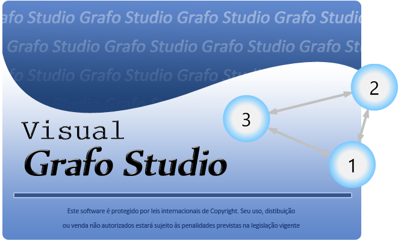
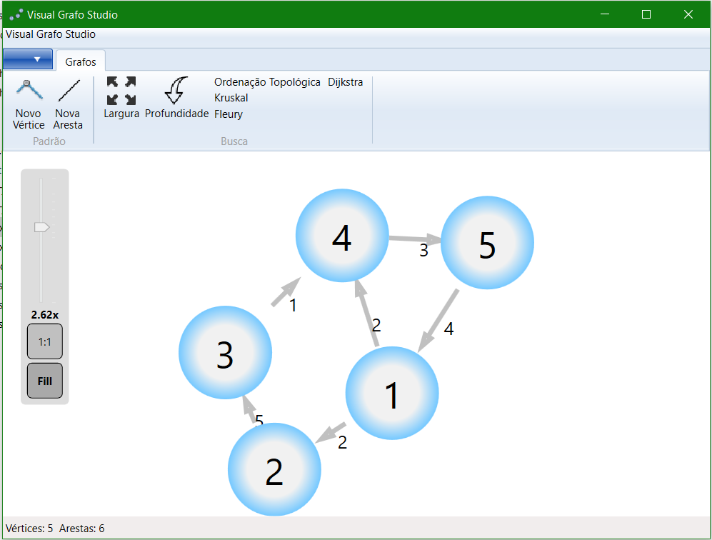

# Visual Grafo Studio
Interface gráfica escrita em C# para aplicação dos mais conhecidos algoritmos de teoria dos grafos.

Visual Grafo Studio é um software desenvolvido para a disciplina de Teoria dos Grafos da Universidade Federal de Ouro Preto.

Através da notação de arquivo DIMACS é possível aplicar vários algoritmos e visualizar graficamente seus resultados. Também é possível gerar um novo grafo inteiramente do zero ou mesmo editar um grafo já existente.

